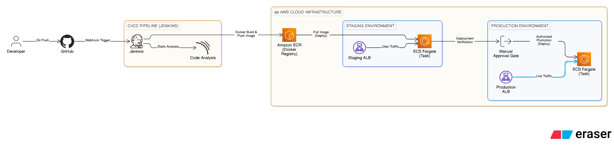
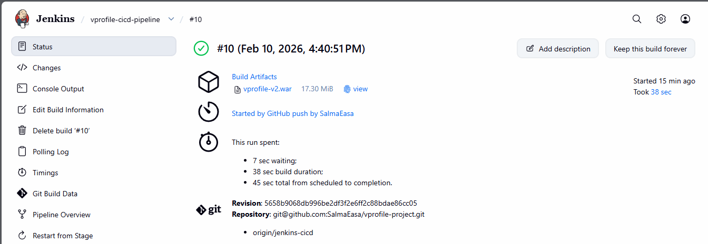
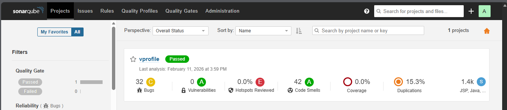
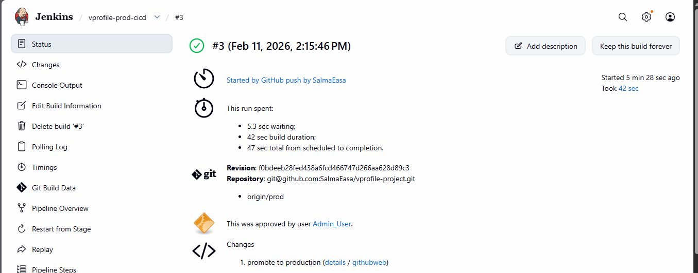
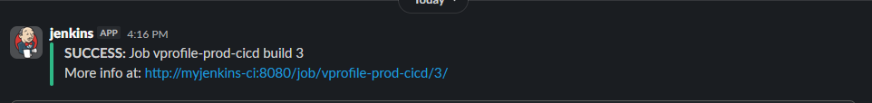

# 🚀 vProfile Multi-tier Java Application: End-to-End CI/CD Pipeline on AWS

## 📌 Project Overview
This project demonstrates a robust, enterprise-grade CI/CD pipeline for a multi-tier Java application (vProfile). The architecture is designed for high availability and scalability, utilizing **Jenkins** for automation and **AWS ECS (Fargate)** for container orchestration.

The goal was to move from a monolithic-style deployment to a modern, containerized microservices-ready infrastructure with integrated security and quality gates.

---

## 🏗️ Architecture & Tools
* **CI/CD Automation:** Jenkins (Pipeline as Code)
* **Source Control:** Git & GitHub (Branching Strategy: main, staging, production)
* **Static Code Analysis:** SonarQube (Quality Gates)
* **Artifact Management:** Sonatype Nexus
* **Containerization:** Docker & Amazon ECR
* **Orchestration:** Amazon ECS (Fargate)
* **Load Balancing:** AWS Application Load Balancer (ALB)
* **Notifications:** Slack Integration

---
## 🏗️ Architecture & Pipeline Design

### 🗺️ System Architecture
The project follows a cloud-native approach, utilizing **AWS ECS Fargate** to achieve a serverless, highly scalable environment. The infrastructure is divided into two isolated environments: **Staging** and **Production**.

### 🚀 CI/CD Workflow Breakdown

The automation is split into two distinct, isolated pipelines to ensure maximum security and stability:

#### 1. Staging Pipeline (Continuous Integration & Testing)
* **Trigger:** Automated via **GitHub Webhooks** on every push to the `staging` branch.
* **Code Quality:** Integrated **SonarQube** for static code analysis and quality gate enforcement.
* **Artifact Management:** Packages the application into a **Docker Image**.
* **Registry:** Pushes the versioned image to **Amazon ECR**.
* **Deployment:** Automatically updates the **ECS Staging Service**, making the app reachable via the **Staging ALB**.

#### 2. Production Pipeline (Controlled Deployment)
* **Strategy:** Immutable Deployment (uses the exact same image verified in Staging).
* **Manual Approval:** Implements a **Governance Gate**. The deployment pauses until a manual sign-off is provided in Jenkins.
* **Promotion:** Once approved, the verified image is promoted to the **Production ECS Cluster**.
* **High Availability:** Managed by a **Production ALB** to ensure zero-downtime and traffic balancing.

---

## 🛠️ Infrastructure Highlights
* **Serverless Execution:** Used **AWS Fargate** to remove the overhead of managing EC2 instances.
* **Security:** Credentials and AWS keys are managed securely via **Jenkins Credentials Store**.
* **Monitoring:** Real-time feedback provided through **Slack Notifications** for build successes and deployment status.

---

## 🌿 Branching Strategy
* `main`: Documentation, Architecture Diagrams, and Stable Release tracking.
* `staging`: Continuous Integration and Testing environment.
* `production`: Stable, peer-reviewed code for live deployment.

---

## 📊 Visualizations (Project Snapshots)

#### 🧪 Staging Environment (Continuous Deployment)
*The staging pipeline ensures that every commit is built, scanned.
* **Build & Artifacts:** Successfully generated `vprofile-v2.war` and stored it for deployment.
* **Pipeline Status:** 
* **Quality Gate:** 

### 🚀 Production Environment
*Deployment triggered from `prod` branch with a mandatory manual approval step for maximum safety.*
* **Pipeline Status:** 
* **Monitoring:** 

---

## 🚀 Key Learning Outcomes
* Architecting scalable environments on AWS using ECS and Fargate.
* Managing sensitive data and credentials securely within Jenkins.
* Implementing notification systems (Slack) for real-time pipeline monitoring.
* Optimizing Docker images for faster deployment cycles.

---
**Prepared by:** [Salma Easa]
